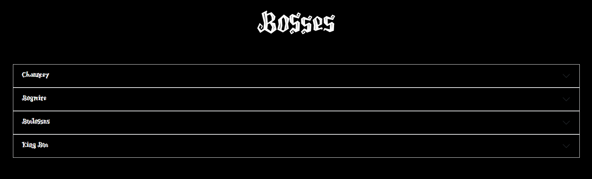
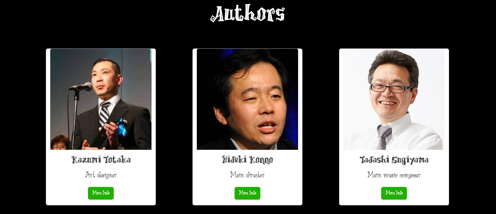

<h1>Project Memory for Markup Languages Evaluation - 1st DAW</h1>
<h2>Luigi's Mansion - Info Page</h2>
<h2>Index</h2>
<ul>
  <li><a href="#introduction">Introduction</a></li>
  <li><a href="#motivation">Motivation</a></li>
  <li><a href="#structure">Structure</a></li>
  <li><a href="#style">Style</a></li>
</ul>

<h2 id="introduction">Introduction</h2>

Work done by: Miguel Ángel Ávila Rosas

Web project bootstrap for the 1st Markup Languages evaluation

February 2024

CC-BY License

<h2 id="motivation">Motivation</h2>

The chosen theme comes from a gamecube game called Luigi's Mansion, it was the first game to ever come up from the console, and it was a very interesting choice to say the least.
Nintendo was always used to show their console with a brand new Mario, but instead we get a "horror" game from Mario's little brother, Luigi, who by the time didn't have his own game.

<h2 id="structure">Structure</h2>

The website is divided into 6 sections (not counting the hero section and the footer):

<ul>
  <li>Hystory</li>
  <li>Bosses</li>
  <li>Mansions</li>
  <li>Authors</li>
  <li>Contacts</li>
  <li>Ghost gallery</li>
</ul>

<h3>History</h3>

It shows a little summary of the main plot of the game, along with the reveal trailer that was shown in the E3 (a game convention).

<h3>Bosses</h3>

Is divided in 4 colums, in each one shows a description of the main boss of the area and how to defeat it, along with an image of the boss itself.

<h3>Mansions</h3>

In this section you can have a look at all the possible mansions that you can get in the game, that depends on how much money you have at he end.

<h3>Authors</h3>

In this section, there are cards for the main creators of th game, like the main director <a href="https://es.wikipedia.org/wiki/Hideki_Konno" target="_blank">Hideki Konno</a>, the art designer
<a href="https://es.wikipedia.org/wiki/Kazumi_Totaka" target="_blank">Kazumi Totaka</a> and the main music composer <a href="https://es.wikipedia.org/wiki/Tadashi_Sugiyama" target="_blank">Tadashi Sugiyama</a>

<h3>Ghost Gallery</h3>

In Luigi's mansion you can capture an entire ghost family, and once you do it, you turn them into pictures, so I decided to make a section with all
the ghost pictures.

<h3>Mansion Contest</h3>

We are making a contest to win a real Mansion! In this section you'll have all the info you need to know to participate

<h2 id="style">Page Style</h2>

<h3>Color Palette</h3>

The game itself is pretty dark, so I decided to use a dark background with white text, along with spooky fonds to make it look scary.

<h3>Typography</h3>

<a href="https://www.fontspace.com/category/spooky" target="_blank">Here is the link where I found the two font types</a>

<h3>Images</h3>

All the pictures come from the <a href="https://www.mariowiki.com/Luigi%27s_Mansion" target="_blank">Super Mario Wiki</a>

<h3>Videos</h3>

<a href="https://www.youtube.com/watch?v=Qp4WwE_6nUc" target="_blank">Link to the trailer</a>

<h2 id="snippets">Code Snippets</h2>

I have used the following:

<ul>
  <li><a href="https://getbootstrap.com/docs/5.3/components/navbar/#how-it-works" target="_blank">TopNav</a></li>
  <li><a href="https://getbootstrap.com/docs/5.3/migration/#accordion" target="_blank">Accordion</a></li>
  <li><a href="https://getbootstrap.com/docs/5.3/components/card/#about" target="_blank">Authors section cards</a></li>
  <li><a href="https://mdbootstrap.com/docs/standard/extended/gallery/" target="_blank">Gallery</a></li>
  <li><a href="https://getbootstrap.com/docs/4.3/components/forms/" target="_blank">Contact Form</a></li>
</ul>
